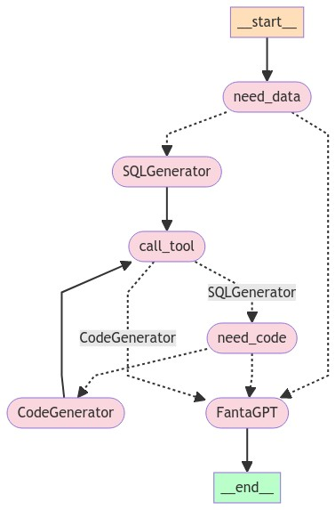

# # FantaGPT: A GPT-Based Agent for Fantasy Football



## Overview

Welcome to **FantaGPT**, an innovative project designed to revolutionize the way fantasy football coaches interact with data and strategies. Built on top of the LangGraph framework, FantaGPT optimizes communication between bots to deliver precise, actionable insights for your fantasy football team.

### Why FantaGPT?

Fantasy football is all about making the right decisions at the right time. But sifting through mountains of data, statistics, and projections can be overwhelming. FantaGPT simplifies this process by automating the analysis and providing you with tailored advice, whether it’s generating SQL queries for specific datasets or offering code snippets for advanced strategies. 

This project is not just a tool—it's a game-changer for fantasy football enthusiasts who want to gain an edge over their competition.

## Features

- **Multi-Agent Collaboration:** FantaGPT uses multiple specialized agents to handle different tasks, from data retrieval to strategy generation.
- **Natural Language Processing:** Communicate with the agents using natural language, making it easier to get the information you need without technical jargon.
- **Customizable Prompts:** Easily modify the behavior of each agent through customizable prompts, allowing for a personalized experience.
- **Seamless Integration:** Integrates with SQL databases and other tools to fetch, process, and display data efficiently.

## Architecture

The architecture of FantaGPT is designed for flexibility and efficiency. Here’s how it works:

1. **Data Request Handling:** The process starts when the coach needs specific data (`need_data`).
2. **SQL Query Generation:** The `SQLGenerator` bot generates the necessary SQL queries.
3. **Tool Execution:** The generated SQL queries are passed to the relevant tools for execution.
4. **Code Generation:** If additional code is needed, the `CodeGenerator` bot steps in to create the necessary scripts.
5. **Final Output:** All outputs are synthesized by the `FantaGPT` agent, providing the coach with actionable insights.

This modular approach ensures that each task is handled by the most appropriate agent, optimizing both speed and accuracy.

## Getting Started

### Prerequisites

- Python 3.7 or higher
- An OpenAI API key
- MySQL database (optional, depending on the data source)

### Installation

1. Clone the repository:

   ```bash
   git clone https://github.com/yourusername/FantaGPT.git
   cd FantaGPT
   ```

2. Install the required dependencies:

   ```bash
   pip install -r requirements.txt
   ```

3. Set up your environment variables for the OpenAI API key:

   ```bash
   export OPENAI_API_KEY='your-api-key'
   ```

4. Configure your MySQL connection if needed by setting up the connection details in `langgraph_bot.py`.

### Usage

1. Customize your prompts in the `bot_prompt.py` file according to your specific needs.
2. Run the main script to start interacting with FantaGPT:

   ```bash
   python langgraph_bot.py
   ```

3. Follow the on-screen instructions to interact with the agents and get insights for your fantasy football team.

## Contributing

We welcome contributions! Feel free to submit pull requests or open issues to improve FantaGPT.

## License

This project is licensed under the MIT License. See the [LICENSE](LICENSE) file for details.

## Contact

For questions or suggestions, feel free to reach out via GitHub issues or contact me directly at [your-email@example.com](mailto:your-email@example.com).
